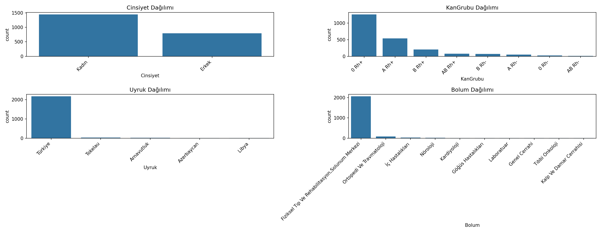

# Talent Academy Case - Data Science 2025  

Exploratory Data Analysis (EDA) and preprocessing pipeline for the **Talent Academy Data Science Case 2025**.  
Bu proje kapsamında sağlık verisi üzerinde **veri temizleme, görselleştirme, one-hot encoding ve feature importance analizi** yapılmıştır.  

---

## 📂 Proje Yapısı  

```bash
talent-academy-case-ds/
│
├── data/
│   ├── Talent_Academy_Case_DT_2025.xlsx   # Ham dataset
│   └── clean_pusula_dataset.csv           # Temizlenmiş dataset
│
├── outputs/
│   ├── eksik_veri_haritasi.png            # Eksik veri görselleştirmesi
│   ├── sayisal_dagilim.png                # Sayısal değişken dağılımları
│   ├── kategorik_dagilim.png              # Kategorik dağılımlar
│   └── feature_importances_top20.png      # Feature importance grafiği
│
├── case_code.py                           # Ana Python kod dosyası
├── README.md                              # Proje açıklaması
└── requirements.txt                       # Bağımlılıklar


## 🚀 Kullanım  
1. Repoyu klonla:  
   git clone https://github.com/Cihaansaahin/talent-academy-case-ds.git  

2. Ortamı hazırla:  
   pip install -r requirements.txt  

3. Kodları çalıştır:  
   python case_code.py  

   # Talent Academy Case DS

Exploratory Data Analysis (EDA) and preprocessing pipeline for Talent Academy Data Science Case 2025.

---
## 📊 Çıktı Görselleri  

### Eksik Veri Haritası  
  

### Sayısal Dağılım  
  

### Kategorik Dağılım  
  

### Feature Importance  
  


## 📊 Çıktılar  
- Eksik veri haritası  
- Sayısal değişken dağılımları  
- Kategorik dağılım grafikleri  
- Temizlenmiş dataset (csv/xlsx)  
- Feature importance grafiği  